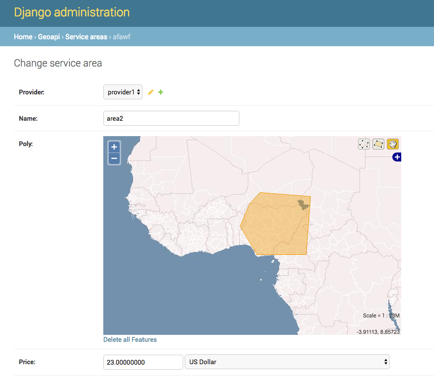

## Django GEOAPI Example

Based on https://github.com/pahaz/docker-compose-django-postgresql-redis-example

UseCase: Many transportation providers define custom polygons as their "service area" and 
we'd like for the owners of these shuttle companies to be able 
to define and alter their polygons whenever they want, eliminating the need.

We'd like you to build a JSON REST API to help us solve this problem.

Once a provider is created they should be able to start defining service areas. These service areas will be geojson polygons and should be stored in the database in a way that they can be retreived and queried upon easily. There should be endpoints to create, update, delete, and get a polygon. A polygon should contain a `name` and `price` as well as the geojson information.

API endpoint should take a lat/lng pair as arguments and return a list of all polygons that include the given lat/lng. The name of the polygon, provider's name, and price should be returned for each polygon. This operation should be FAST.

Include:

 - Django
 - PostgreSQL
 - Redis

Requirements:

 - Docker >= v1.10.3
 - Docker Compose >= v1.7.1
 - Python >= 3.5

## API ##

You can get more details and examples here: http://127.0.0.1:8000/api/v1/

GEOJSON Objects examples:

	- {"type":"Point","coordinates":[9.26436996459961,10.564178042345375]}
	- {"type":"Polygon","coordinates":[[[6.15234375,10.9423828125],[6.328125,9.31640625],[8.701171875,9.84375],[7.8662109375,11.513671875],[6.6357421875,12.1728515625],[6.15234375,10.9423828125]]}

Short API Overview:

	- `GET /api/v1/providers/` -- retrieve all transportation providers
	- `POST /api/v1/providers/ {"name": "required", "email": "", "phone": null, "language": null, "currency": ""}` -- create transportation provider

	- `GET /api/v1/service-areas/` -- retrive all service-areas for all providers in GEOJSON format
	- `GET /api/v1/service-areas/?poly__contains={"type":"Point","coordinates":[9.26436996459961,10.564178042345375]}` -- filter a list of all service areas that include the given point
	- `GET /api/v1/service-areas/?provider_id=1` -- filter a list of all service-areas for a provider ID
	- `POST /api/v1/service-areas/ {"name": "required", "provider_id": "required", "price": "required", "poly": "required; GeoJson Polygon"}` -- create a service provider area

### OS X Docker Native Instruction

1. Start Docker Native
1. Build images - `docker-compose build`
1. Create the database migrations - `docker-compose run web python manage.py migrate`
1. Start services - `docker-compose up`
1. View in browser http://127.0.0.1:8000/

### OS X Docker Machine Instruction

1. Start new machine - `docker-machine create -d virtualbox dev;`
1. Build images - `docker-compose build`
1. Create the database migrations - `docker-compose run web python manage.py migrate`
1. Start services - `docker-compose up -d`
1. Grab IP - `docker-machine ip dev` - and view in your browser
